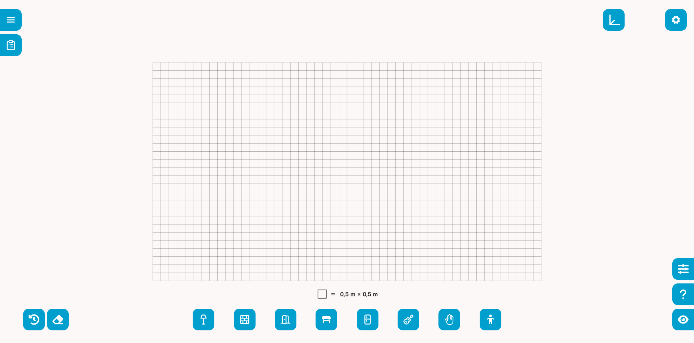
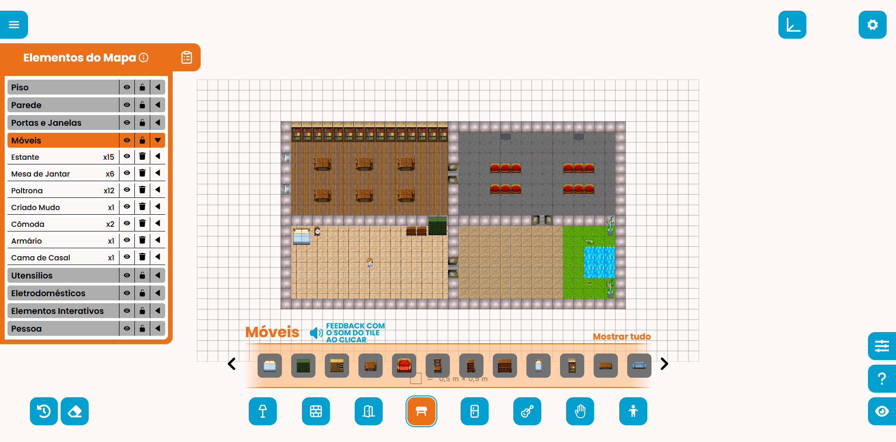

# Plataforma E3

A Plataforma E3 é uma aplicação web para criação e edição de mapas baseados em um GRID, permitindo a construção visual de ambientes por meio de camadas, tiles e elementos interativos. O projeto possibilita posicionar pisos, paredes, portas, janelas, móveis, utensílios, eletrônicos, objetivos e um personagem em um grid, gerando uma estrutura de mapa que pode ser utilizada por players compatíveis.

A plataforma é responsável por gerar os mapas que serão utilizados pelos players para produzir os executáveis finais. Esses executáveis são utilizados em diferentes plataformas, como dispositivos Android no caso do OMA-Player e ambientes de realidade virtual no caso do Ena-Rewritten.

O objetivo final desses executáveis é proporcionar experiências acessíveis para pessoas com deficiência visual, permitindo que elas aprimorem suas habilidades de geolocalização ao explorar ambientes, lidar com obstáculos e localizar objetos posicionados no mapa, que emitem sons para auxiliar na navegação.


## Interface da aplicação

A interface da Plataforma E3 foi projetada para oferecer uma experiência visual e intuitiva na criação de mapas. O usuário interage diretamente com um grid central e utiliza painéis laterais para selecionar e posicionar elementos no ambiente.

Também é possível manipular os itens inseridos, utilizando ferramentas como seleção, rotação, remoção e apagador por área.







## Como rodar o projeto

### Pré-requisitos

Antes de iniciar, é necessário ter instalado:

* **Node.js**
* **npm**

### Instalação

Clone o repositório:

```bash
git clone https://github.com/Project-OMA/Plataforma-E3
```

Acesse a pasta do projeto:

```bash
cd Plataforma-E3
```

Instale as dependências:

```bash
npm install
```

Execute o servidor de desenvolvimento:

```bash
npm run dev
```

Acesse o endereço local exibido no terminal após iniciar o servidor:

```bash
http://localhost:5173
```

## Gerando a build

Para gerar a versão de produção do projeto, execute:

```bash
npm run build
```

A build será gerada na pasta:

```bash
dist/
```

Para visualizar a build localmente, é possível utilizar:

```bash
npm run preview
```

## Estrutura do mapa gerado

A plataforma gera uma estrutura de mapa organizada por tamanho e camadas. Cada camada representa um conjunto específico de elementos do ambiente.

Exemplo simplificado de JSON gerado:

```json
{
  "size": [10, 10],
  "layers": {
    "walls": [],
    "floors": [],
    "door_and_windows": [],
    "furniture": [
      {
        "type": "0.1",
        "pos": [2, 4]
      }
    ],
    "utensils": [],
    "eletronics": [
      {
        "type": "2.2",
        "pos": [5, 3],
        "id": "TV0"
      }
    ],
    "goals": [],
    "persons": []
  }
}
```

### Camadas principais

O JSON exportado é organizado em camadas como:

* `walls` — paredes;
* `floors` — pisos;
* `door_and_windows` — portas e janelas;
* `furniture` — móveis;
* `utensils` — utensílios;
* `eletronics` — eletrônicos;
* `goals` — objetivos ou elementos interativos;
* `persons` — personagens.

## Elementos programáveis

Alguns elementos do mapa podem ser marcados como programáveis. Quando isso acontece, o elemento recebe um campo `id` durante a geração do JSON.

Esse identificador permite que o elemento seja reconhecido de forma individual pelos players que consomem o mapa, possibilitando também a criação de comportamentos dinâmicos associados a ele, como a exibição de vídeos, interações específicas ou outras funcionalidades conforme a necessidade.

Exemplo:

```json
{
  "type": "2.2",
  "pos": [5, 3],
  "id": "TV0"
}
```

A geração dos identificadores considera o tipo do objeto e cria uma numeração sequencial, permitindo diferenciar múltiplos elementos do mesmo tipo.